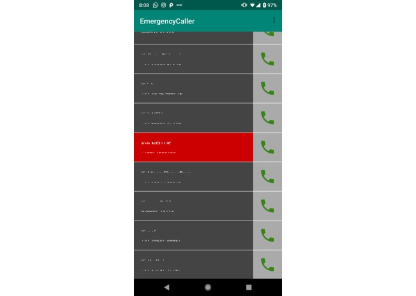

# EmergencyCaller
This project was made at Brickhack V, RIT, NY in collaboration with [Bishwarup Neogy](https://github.com/bishneo) and Partho Mitra  

## Tech stack
android | android-studio | node.js | express.js | mongodb | firebase cloud messaging

## Inspiration
17 missed calls from Mom.

## What it does
Our application uses a whitelist on both ends. So the person you are calling will have the app installed with your number in their whitelist. If that is the case, then when you choose to make an emergency call to that person through the app, the call will ring at full volume even if the phone is on silent mode so that you never miss another emergency because of the silent mode.

## How we built it
We built it using Android Studio for the app and MongoDB, Express.js, Node.js for the backend. We also used Firebase Cloud Messaging Service for inter-device communication. We plan to eventually host the server on AWS once we have worked out the bugs.

## Challenges
The connection between the devices and the servers and sending data back and forth in the proper format so that it can be used for different controls for example, we faced a compatibility issue with Android 9 which we had to fix.

## Learning from this project
Sushi is a good midnight snack...and this was our first hackathon so it was a thrilling experience to be able to complete the entire project within the span of 24 hours. However, we feel that we could have probably done better had we planned a bit more ahead of the hackathon. We also got to know about a lot of interesting projects which we are sure will give us inspiration for the coming hackathons that we attend.

## What's next for Emergency Caller
We plan to publish it on the Google Play Store. So we want to get rid of all the minor bugs and add more features like deleting whitelisted numbers, requesting other people to add you to their whitelists etc.

## [Devpost submission](https://devpost.com/software/emergency-caller)
